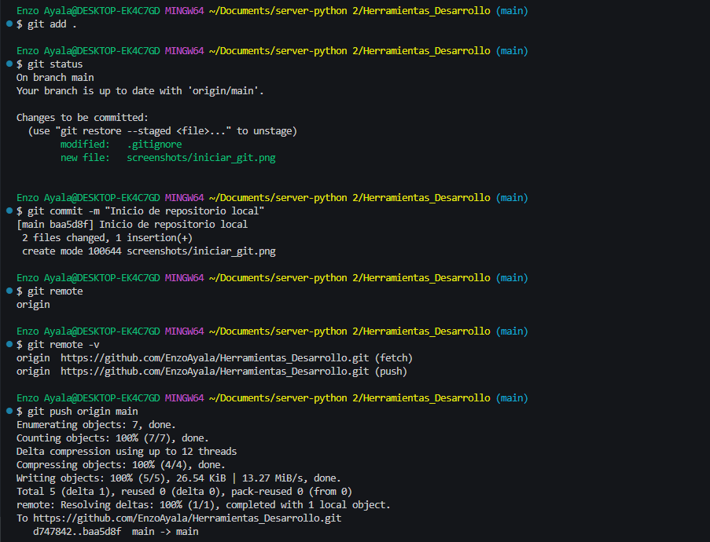

# 🛒 Carrito de Compras – Proyecto 
---
## 📘 Descripción del Proyecto
El **Carrito de Compras** es una aplicación web que permite a los usuarios navegar productos, agregarlos a un carrito virtual y realizar una compra simulada.  
El sistema está desarrollado con **Flask (Python)** en el backend, conectado a **MySQL** como base de datos, y utiliza **HTML, CSS y JavaScript** para la interfaz de usuario.  
El proyecto busca mostrar la integración entre frontend, backend y base de datos, siendo una base para futuras implementaciones de e-commerce.

## 🛠️ Tecnologías Utilizadas
- Python / Flask 
- Html/ CSS/ JavaScript / 
- Git / GitHub
- Base de datos... MySql

## 🚀 Instalación y Ejecución
Pasos para instalar y correr el proyecto...

### 1. Instalar Dependencias
Instala los paquetes necesarios ejecutando los siguientes comandos en tu terminal:

```bash
pip install Flask
```
```bash
pip install Flask-Cors
```
```bash
pip install Flask-Login
```
```bash
pip install Flask-SQLAlchemy
```
```bash
pip install mysql-connector-python
```
### 2. Ejecutar la Aplicación
Ir a la carpeta donde se encuentra el archivo `app.py` y ejecuta el siguiente comando:
```bash
python app.py
```
Esto iniciará el servidor en `http://127.0.0.1:5000/`.
### 3. Acceder a la Aplicación
Abre tu navegador y navega a la siguiente URL para acceder a la aplicación:
```bash
http://127.0.0.1:5000/
```
---
 
## 👥 Roles y Créditos
| Nombre | Rol | Funciones |
|--------|-----|-----------|
| Enzo | Dev Backend | Implementó todo el backend |
| Brillight | Frontend | Realizado la estructura|
| Adrian | Manejo de errores | Se encargo de los concflictos |

## 🔄 Flujo de Trabajo en Git
- Estructura de ramas: `feature/`, `fix/`
- Ejemplo de commit atómico:
  ```bash
  git commit -m "feat: agregar funcionalidad para eliminar producto del carrito"
  ```
  
## 🖼️ Capturas de Pantalla

### 🖼️ Captura de comandos
---
- Iniciamos git clonando el repositorio

- Realizamos el primer commit y lo subimos al repositorio

- Sincronizamos los datos del primer commit a otra computadora

- Realizamos un git checkout -b feature/frontend

- Agregamos los nuevos cambios y realizamos un commit

- Subimos los cambios al GitHub

- Nos movemos de la rama Main a la rama Feature/Registros_login y realimos un commit y luego lo subimos al GitHub


- Creamos nuestro primer pull request

- Examinamos el segundo pull request y hacemos y merge


- Resolvemos nuestro primer conflicto


- Ejemplo de git restore 


- Historial de puntos de control


- Historial de cabeceras


### 🏠 Página Principal
--- 
- Prototipo de la página principal -    Inicio

- Prototipo login 

- Prototipo registro
![Registrar] (./screenshots/registro.png)

